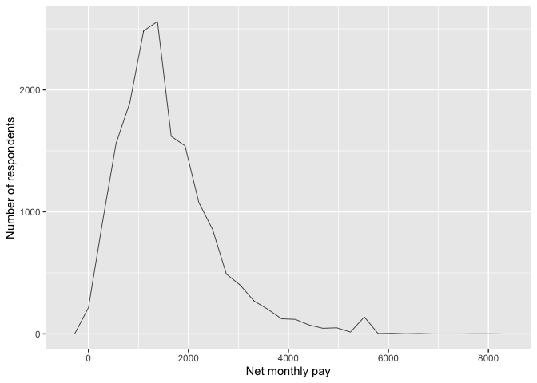
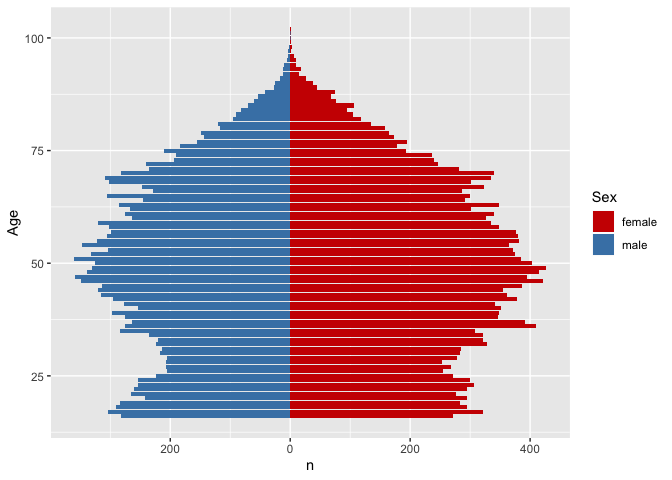

Statistical assignment 4
================
Asli Hasanli
29/02/2020

In this assignment you will need to reproduce 5 ggplot graphs. I supply
graphs as images; you need to write the ggplot2 code to reproduce them
and knit and submit a Markdown document with the reproduced graphs (as
well as your .Rmd file).

First we will need to open and recode the data. I supply the code for
this; you only need to change the file paths.

    ```r
    library(tidyverse)
    Data8 <- read_tsv("/Users/asli/Desktop/data/tab/ukhls_w8/h_indresp.tab")
    Data8 <- Data8 %>%
        select(pidp, h_age_dv, h_payn_dv, h_gor_dv)
    Stable <- read_tsv("/Users/asli/Desktop/data/tab/ukhls_wx/xwavedat.tab")
    Stable <- Stable %>%
        select(pidp, sex_dv, ukborn, plbornc)
    Data <- Data8 %>% left_join(Stable, "pidp")
    rm(Data8, Stable)
    Data <- Data %>%
        mutate(sex_dv = ifelse(sex_dv == 1, "male",
                           ifelse(sex_dv == 2, "female", NA))) %>%
        mutate(h_payn_dv = ifelse(h_payn_dv < 0, NA, h_payn_dv)) %>%
        mutate(h_gor_dv = recode(h_gor_dv,
                         `-9` = NA_character_,
                         `1` = "North East",
                         `2` = "North West",
                         `3` = "Yorkshire",
                         `4` = "East Midlands",
                         `5` = "West Midlands",
                         `6` = "East of England",
                         `7` = "London",
                         `8` = "South East",
                         `9` = "South West",
                         `10` = "Wales",
                         `11` = "Scotland",
                         `12` = "Northern Ireland")) %>%
        mutate(placeBorn = case_when(
                ukborn  == -9 ~ NA_character_,
                ukborn < 5 ~ "UK",
                plbornc == 5 ~ "Ireland",
                plbornc == 18 ~ "India",
                plbornc == 19 ~ "Pakistan",
                plbornc == 20 ~ "Bangladesh",
                plbornc == 10 ~ "Poland",
                plbornc == 27 ~ "Jamaica",
                plbornc == 24 ~ "Nigeria",
                TRUE ~ "other")
        )
    ```

Reproduce the following graphs as close as you can. For each graph,
write two sentences (not more\!) describing its main message.

1.  Univariate distribution (20 points).

The greatest number of respondents had net montly pay of between 1000
and 1500. After 1500, the number declines as there aren’t as many people
earning above this.

``` r
ggplot(Data, aes(x = h_payn_dv)) +
        geom_freqpoly(size = 0.25) + 
        ylab("Number of respondents") + 
        xlab("Net monthly pay")
```

<!-- -->

2.  Line chart (20 points). The lines show the non-parametric
    association between age and monthly earnings for men and women.

This shows that men earn more monthly at all ages than women, with the
highest difference at middle ages (35-50) starting from about 25. Men’s
income increases faster during the middle ages than women’s, and both
decline after 50’s.

``` r
ggplot(data = Data) + 
    geom_smooth(mapping = aes(x=h_age_dv,    y=h_payn_dv, linetype = sex_dv), color="black", size = 0.75)+
  labs(x="Age", y="Monthly earnings", linetype="Sex")+
          xlim(15,65)
```

<!-- -->

3.  Faceted bar chart (20 points).

Males from all backgrounds earn more than females in the same
backgrounds. The difference is highest in Irish and lowest in Bangladesh
born respondents.

``` r
Bar <- Data %>%
        filter(!is.na(placeBorn)) %>%
        filter(!is.na(sex_dv)) %>%
        group_by(placeBorn, sex_dv) %>%
        summarise(
medianearning = median(h_payn_dv, na.rm = TRUE)
  )  
    
Bar %>%
ggplot(aes(x = sex_dv, y = medianearning)) +
geom_bar(stat="identity") +
xlab("Sex") +
ylab("Median monthly net pay") +
facet_wrap(~ placeBorn)
```

<!-- -->

``` r
# pay and sex by region
```

4.  Heat map (20 points).

This shows the average age of people in regions of the UK grouped by
their place of birth. The youngest people in this study are Nigerian
born residents in Scotland, and the oldest are Jamaican born residents
in Scotland.

``` r
Heat <- Data %>%
        filter(!is.na(h_gor_dv)) %>%
        filter(!is.na(placeBorn)) %>%
        group_by(placeBorn, h_gor_dv) %>%
        summarise(meanage = mean(h_age_dv, na.rm = TRUE))  


Heat %>%
ggplot(aes(x = h_gor_dv, y = placeBorn)) + 
geom_tile(aes(fill = meanage)) + 
xlab("Region") +
ylab("Country of birth") +
labs(fill="Mean age") + 
theme(axis.text.x = element_text(angle = 90, hjust = 1))
```

<!-- -->

5.  Population pyramid (20 points).

This shows the number of men and women at every age. At most age groups,
especially after 50s, there are more women than men and that most people
are aged around 40-70.

``` r
Pyramid <- Data %>%
        select("sex_dv", "h_age_dv") %>%
        filter(!is.na(h_age_dv)) %>%
        filter(!is.na(sex_dv)) 
    

Pyramid %>%    
ggplot(aes(x = h_age_dv, fill = sex_dv)) + 
  geom_bar(data = subset (Pyramid, sex_dv == "female")) +
    geom_bar(data = subset (Pyramid, sex_dv == "male"), aes(y=..count..*(-1))) +
    labs(fill="Sex", y="n", x="Age")+
    scale_colour_manual(values = c("red3", "steelblue"),
                        aesthetics = c("colour", "fill")) +
    scale_y_continuous (labels = abs) +
  coord_flip()
```

<!-- -->
